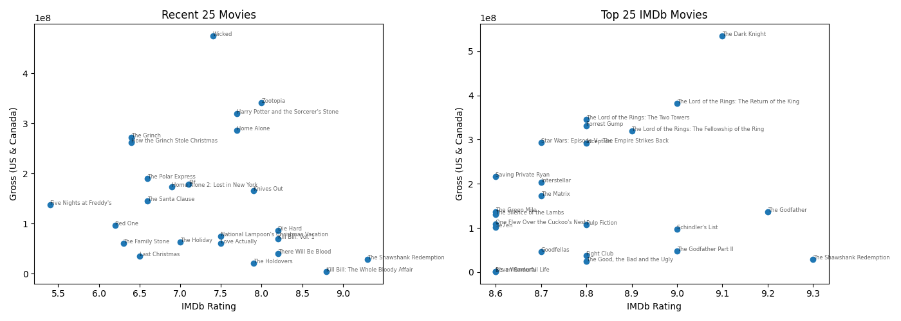

# IMDB_Scrape
Final Project scraping IMDB

# IMBD Movie Scrape – Final Project

## Overview
This project's goal was to scrape two lists of movies: A list of 25 recent movies, and the top 25 rated movies according to IMDB. Then, some basic analysis and visualizations were created based on the scraped data to explore any trends or interesting differences between the two lists, specifically in terms of ratings and gross sales (US & Canada).

## Data Description
- Source: IMDB website
Data scraped with BeautifulSoup in Python

- Variables include: movie title, movie id, IMDB rating, gross sales (US & Canada)
## Methods
- Web Scraping: BeautifulSoup library in Python

Function used to scrape movie IDs from IMDB pages:
```{python}
def scrape_ids(url, headers):
    """Fetches a URL and extracts unique TT IDs from all /title/tt links."""
    movie_ids = []
    
    try:
        response = requests.get(url, headers=headers)
        response.raise_for_status() 
        soup = BeautifulSoup(response.text, 'html.parser')

        # Find ALL links (<a> tags) on the page whose 'href' attribute starts with '/title/tt'
        for link in soup.find_all('a', href=lambda href: href and href.startswith('/title/tt')):
            
            full_link = link.get('href')
            link_parts = full_link.split('/')
            
            # The TT ID is the third part of the URL path
            if len(link_parts) >= 3 and link_parts[2].startswith('tt'):
                tt_id = link_parts[2]
                
                if tt_id not in movie_ids:
                    movie_ids.append(tt_id)
        
        return movie_ids
        
    except requests.exceptions.RequestException as e:
        print(f"Error fetching {url}: {e}")
        return []
``` 

- Regression, visualization, and correlation
Used smf.ols regression to get stats like R, R^2, and coefficient
- Visualized with scatter plots
Used .corr to get the correlation of the outcome variables. 


## Results
- Visualizations created using Matplotlib and Seaborn libraries in Python



- Overall, there was no significant relationship between IMDB rating and Gross Sales (US & Canada)

- There are some interesting differences between the two groups:
    The “Top Movies” group had a much higher correlation between Rating and Gross (.21 vs .006). This suggests some meaningful signal in ratings as a predictor for top movies(very small).
        However, the slope for the “Top Movies” was smaller, likely due to the compressed nature of the ratings (tighter x-axis range)

